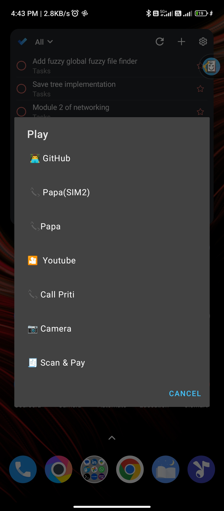
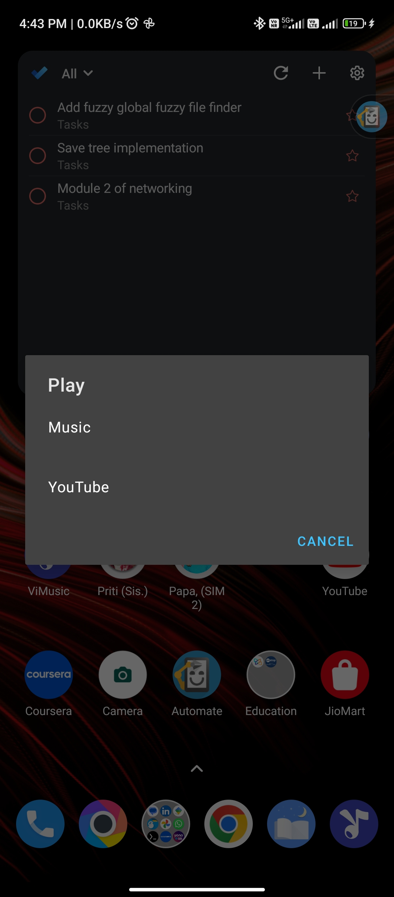

# automate_flow
Automating my Android phone using Automate - LlamaLab, This is only a hobby projects and a short of back-up. 🥂.👨‍💻. 

### Google Assistant activation button replaced with Dialog of Quick UPIScan and Other my own useful shortcuts 

### When My Bluetooth headphones get connect, this will suggest you some apps that you can use with it for ex: music app, youtube ....Your choices 😉. 

